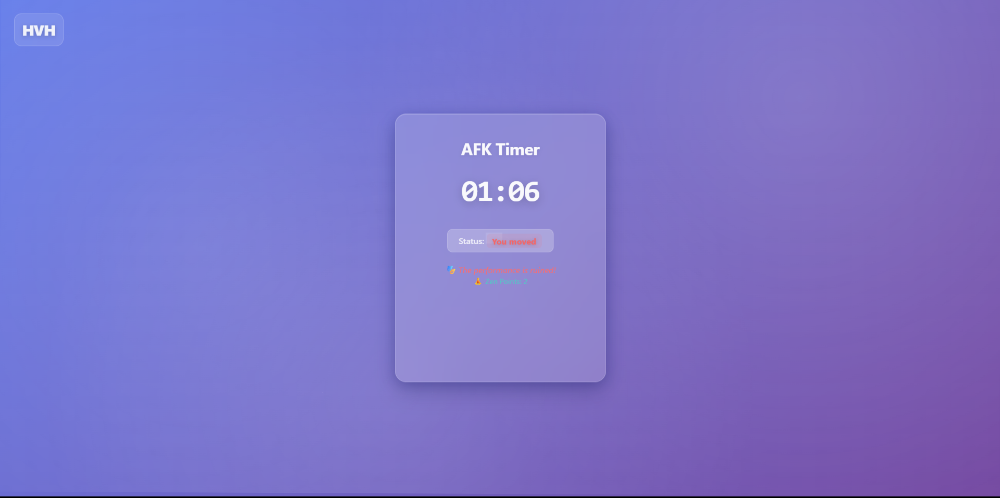

# HVH 🎯

## Basic Details
### Team Name: Team Five
### Team Members
- **Sreedev S S (Team Lead)** - College of Engineering, Attingal
- **Harigovind P Nair** - College of Engineering, Attingal

### Project Description
The ultimate AFK (Away From Keyboard) timer that celebrates your commitment to doing absolutely nothing. It's a sophisticated procrastination tool that rewards stillness and punishes productivity with zen points and philosophical enlightenment.

### The Problem (that doesn't exist)
In today's hyper-productive world, people are constantly moving, clicking, typing, and being useful. There's a severe lack of appreciation for the ancient art of sitting perfectly still and accomplishing nothing. How do we measure and gamify our commitment to inactivity?

### The Solution (that nobody asked for)
Our revolutionary AFK Timer tracks your motionlessness with scientific precision, awards zen points for stillness, delivers philosophical insights about doing nothing, and celebrates your achievements in the noble pursuit of absolutely zero productivity. Complete with glassmorphism UI because even procrastination deserves to look premium!

## Technical Details
### Technologies/Components Used
For Software:
- **Languages**: HTML5, CSS3, JavaScript
- **Frameworks**: Vanilla JavaScript (because frameworks are too productive)
- **Libraries**: 
  - Canvas Confetti (for celebrating achievements)
  - Web Audio API (for sound effects)
- **Tools**: 
  - Modern CSS (Glassmorphism effects)
  - CSS Grid & Flexbox
  - CSS Animations & Transitions

For Hardware:
- A computer/device capable of detecting your shameful movements
- Mouse (for disappointing the system)
- Keyboard (for destroying zen moments)
- Screen (to witness your failure at staying still)


# Installation
```bash
# Clone the repository
git clone https://github.com/MTCodes01/Team-Five-CEAL

# Navigate to project directory
cd Team-Five-CEAL

# No dependencies to install - it's beautifully simple!
```

# Screenshots (Add at least 3)

*The serene idle state showing timer, zen points, and motivational message encouraging your commitment to nothingness*


*The dramatic moment when movement is detected - shame notification and disappointed status message*


*Epic confetti celebration when reaching the legendary 5-minute mark of absolute stillness*

### Project Demo
# Video
<video controls src="assets/HVH.mp4" title="HVH - AFK Timer Demo"></video>

*Demo video showcasing the complete HVH experience - from peaceful stillness tracking to the epic confetti celebration at milestone achievements*

### Website Link
[here](https://sreedevss.me/HVH-Hyperloop-Virtual-Hub)

## Team Contributions
- **Sreedev S S**: 
  - Core AFK detection algorithm
  - Glassmorphism UI design and CSS architecture
  - Sound effects implementation using Web Audio API
  - Philosophical message curation and zen point system
  
- **Harigovind P Nair**: 
  - Timer logic and milestone celebration system
  - Confetti animation integration
  - Movement detection optimization
  - User experience flow design

## Features That Make It Useless (And Brilliant)
- 🎯 **Precision Stillness Tracking**: Detects even the slightest mouse twitch
- 🧘 **Zen Point System**: Gamifies your commitment to inactivity
- 🎉 **Milestone Celebrations**: Epic confetti for achieving new levels of nothingness
- 💭 **Philosophical Insights**: Deep thoughts about the art of doing nothing
- 🔊 **Sound Effects**: Audio feedback for every interaction (or lack thereof)
- ✨ **Glassmorphism UI**: Premium design for premium procrastination
- 😤 **Shame System**: Disappointed messages when you dare to move
- 🏆 **Achievement Unlocks**: Progress from "Beginner Sitter" to "Universal Constant of Idleness"

## Why This Project Matters (It Doesn't)
In a world obsessed with productivity metrics, we've created the ultimate anti-productivity metric. This project celebrates the human capacity for beautiful, purposeful stillness while providing the dopamine hits of gamification for doing literally nothing.

---
Made with ❤️ at TinkerHub Useless Projects 


